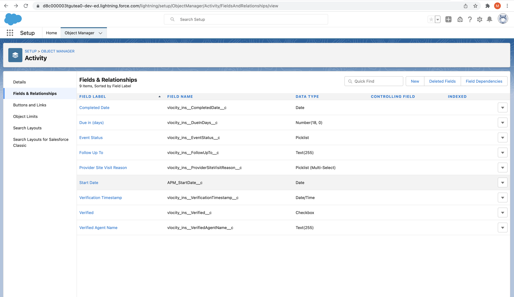
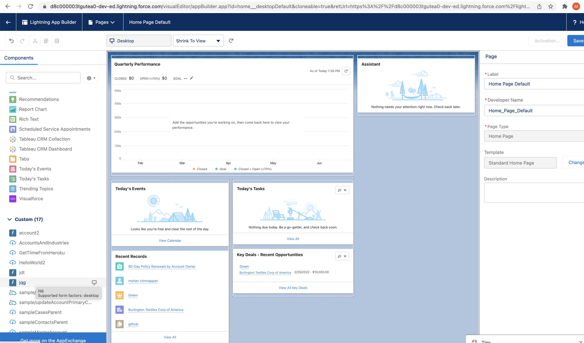

# How to deploy to your Org


- Create your SFDX project

```
sfdx force:project:create -n MyGanttProject


```

```
target dir = /Users/mchinnappan
   create MyGanttProject/config/project-scratch-def.json
   create MyGanttProject/README.md
   create MyGanttProject/sfdx-project.json
   create MyGanttProject/.husky/pre-commit
   create MyGanttProject/.vscode/extensions.json
   create MyGanttProject/.vscode/launch.json
   create MyGanttProject/.vscode/settings.json
   create MyGanttProject/force-app- /main/default/lwc/.eslintrc.json
   create MyGanttProject/force-app/main/default/aura/.eslintrc.json
   create MyGanttProject/scripts/soql/account.soql
   create MyGanttProject/scripts/apex/hello.apex
   create MyGanttProject/.eslintignore
   create MyGanttProject/.forceignore
   create MyGanttProject/.gitignore
   create MyGanttProject/.prettierignore
   create MyGanttProject/.prettierrc
   create MyGanttProject/jest.config.js
   create MyGanttProject/package.json

```
- Download zip file:  [jqg.zip](./jqg.zip) to ~/Downloads folder

- unzip that file ~/Downloads/jqg.zip into the above project directory

```

unzip ~/Downloads/jqg.zip 

```

- Project folder structure will be like this:
```
tree
.
├── README.md
├── config
│   └── project-scratch-def.json
├── force-app
│   └── main
│       └── default
│           ├── applications
│           ├── aura
│           ├── classes
│           │   ├── Tasks.cls
│           │   └── Tasks.cls-meta.xml
│           ├── contentassets
│           ├── flexipages
│           ├── layouts
│           ├── lwc
│           │   ├── jqg
│           │   │   ├── jqg.html
│           │   │   ├── jqg.js
│           │   │   └── jqg.js-meta.xml
│           │   └── jsconfig.json
│           ├── objects
│           ├── permissionsets
│           ├── staticresources
│           │   ├── gantt15.resource
│           │   └── gantt15.resource-meta.xml
│           ├── tabs
│           └── triggers
├── jest.config.js
├── package.json
├── scripts
│   ├── apex
│   │   └── hello.apex
│   └── soql
│       └── account.soql
└── sfdx-project.json


```

- Login into your org 

- For Sandbox org
```

sfdx force:auth:web:login -r https://test.salesforce.com


```

-  For Production org
```

sfdx force:auth:web:login -r https://login.salesforce.com


```
Successfully authorized mohan.chinnappan.n_os@gmail.com with org ID 00D8c000003TgUTEA0


```
- Note the user-name from the above line

### Deploy Apex Class
```
sfdx force:source:deploy -u   mohan.chinnappan.n_os@gmail.com -p force-app/main/default/classes 

```
```
*** Deploying with SOAP API v53.0 ***
Deploy ID: 0Af8c00000G3czeCAB
DEPLOY PROGRESS | ████████████████████████████████████████ | 0/0 Components

=== Component Failures [1]
Type   Name   Problem
─────  ─────  ───────────────────────────────────────────────────────────────────────────────────────────────────────────────────────────────────────────────────────────────────────────────────────────────────────────────────────────────────────────
Error  Tasks  SELECT Subject,ActivityDate,APM_StartDate__c, Status
                                          ^
              ERROR at Row:1:Column:29
              No such column 'APM_StartDate__c' on entity 'Task'. If you are attempting to use a custom field, be sure to append the '__c' after the custom field name. Please reference your WSDL or the describe call for the appropriate names. (8:15)

ERROR running force:source:deploy:  Deploy failed.

```

- Make sure you have APM_StartDate__c field in Activity SObject

- 

- After adding this field rerun the deploy classes

```
sfdx force:source:deploy -u   mohan.chinnappan.n_os@gmail.com -p force-app/main/default/classes 

```
```
DEPLOY PROGRESS | ████████████████████████████████████████ | 1/1 Components

=== Deployed Source

```

### Deploy Static resources
```
 sfdx force:source:deploy -u   mohan.chinnappan.n_os@gmail.com -p force-app/main/default/staticresources 

 ```

 ```
 Deploy ID: 0Af8c00000G3dgtCAB
DEPLOY PROGRESS | ████████████████████████████████████████ | 1/1 Components

=== Deployed Source

```

### Deploy LWC
```
sfdx force:source:deploy -u   mohan.chinnappan.n_os@gmail.com -p force-app/main/default/lwc            
*** Deploying with SOAP API v53.0 ***
Deploy ID: 0Af8c00000G3dwFCAR
DEPLOY PROGRESS | ████████████████████████████████████████ | 1/1 Components

=== Deployed Source
```

### See this component in App Builder

- 


